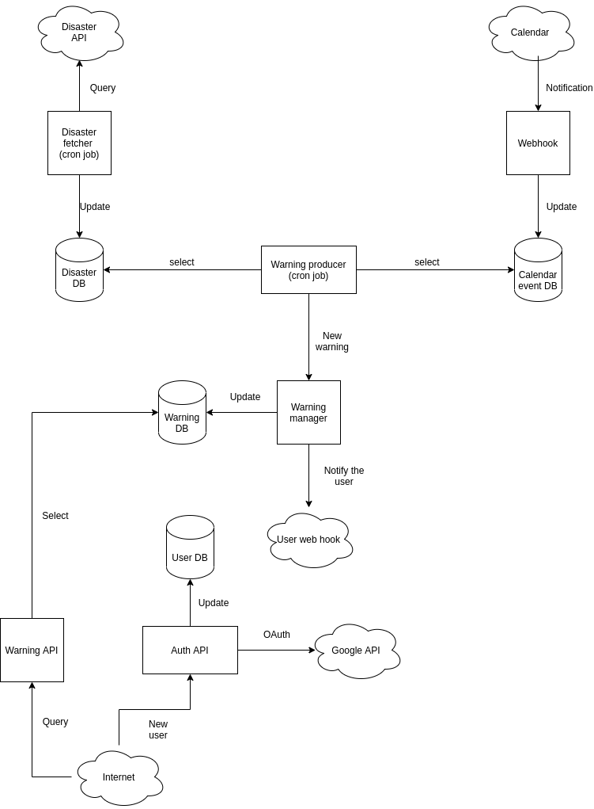
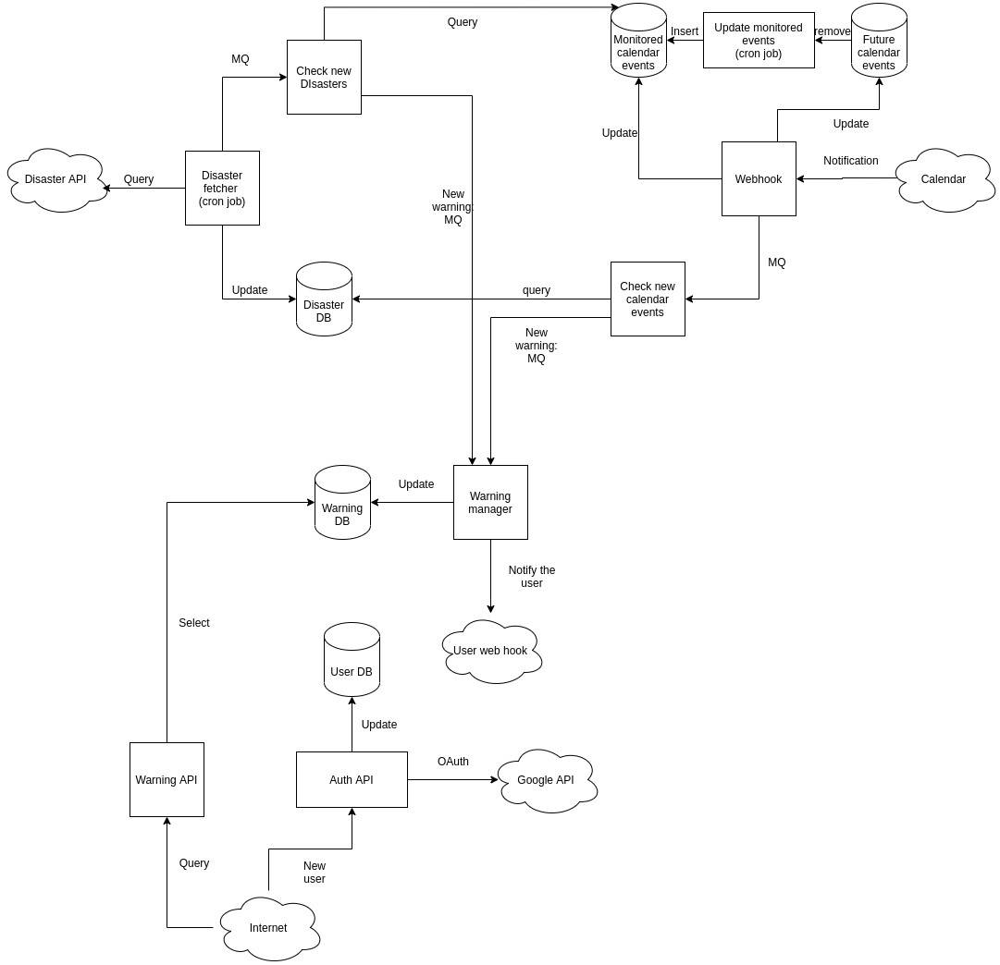

# Disaster tracker

## Functionality
1. Authentication and authorization:
  - The user can create an account, delete an account
  - The user receives an API token which can later be used to query the API
2. Events monitoring
  - The API monitors events from the user's Google calendar and updates from the disaster API and notifies the user
  when some disaster happens close to the user's location.

## Implementation
### Authentication and authorization
The user can create an account by sending a POST request to one of the API endpoints. The body of the request must include:
- User's login (required)
- User's password (required)
- Configuration parameters for the API (optional) - will be described later.
Upon receiving the request, the API queries the Google Calendar API to get the access to the user's calendars [1] (an example is at [7]).

Google supports only the OAuth protocol. This complicates the implementation:
1. To get the API token from Google, the user must open a browser and confirm the request.
2. When the request is confirmed, Google sends a new request to the callback endpoint containing the API key. The callback endpoint
must be specified in the original request.
Detailed explanation of how authorization works with Google can be found at [6].

There is a Google Java client but the implementation is blocking. Also, the implementation is somewhat unusual and I think it might be hard to integrate it with
our backend - needs to be investigated.

### Calendar monitoring
Google Calendar API supports push notifications using a webhook [2]. The only constraint is that the Google can only send requests to verified
domain names only on HTTPS protocol. The detailed explanation of how domain names can be verified is available at [2].

To receive notifications about created or updated events in the user's calendar we can use the `watch` endpoint of the Calendar API [3].
We would need to set up an appropriate hook on our side to recieve these notifications. Our hook will recieve notifications for both newly created events
and updated events - this will affect our preprocessing of these events which will be described later.

### Disaster monitoring
Disaster events can be queried from some provided APIs [4] [5]. Which API we use is not particularly relevant at the moment - the only difference will be in the way we determine which disaster events affect which calendar events (more on that later). We can set up a cron job that will query the disaster API on a regular basis and store received events into the database.

### Matching disasters with calendar events
A reasonable way to determine whether some disaster event affects any of the calendar events would be to select all disaster events at a specified radius from the calendar event. This method is appropriate for the [4] disaster API, which provides precise coordinates of the former.

A different approach would be to match a general location of both the disaster event and the calendar event. For example, we can consider some calendar event to be affected by the disaster if both events occur in the same country. This method is suitable for the [5] API.

If the first method is selected, we will need to determine the precise coordinates of the calendar event since the calendar API only provides a textual representation of the address. We can use Google's Maps API to achieve that. We can also use this API to determine the distance between two points on the globe.

If we choose the second approach, we would still need to use the Maps API to determine the country of the address. However, this time it would be more complicated to determine if two events are from the same location since we can have two different strings describing the same country (e.g. `USA` and `US` or `US` and `United States of America`). Thus, I think that the first approach is the better option.

### User-specified configurations
It might be a good idea to allow users to configure various parameters of our API. These might include:
1. The time interval for the Calendar events that can receive warnings from our API.
Users can create calendar events for any point in time. It doesn't make any sense to produce warnings for events from the past since those have already happened. It also doesn't make much sense to produce warnings for the events in the far future since a lot can change before those events occur. Thus, the user can specify the amount of days to determine which calendar events should be monitored. We call this `Calendar time-frame`. More precisely, given the calendar time-frame `T` and some calendar event `E`, event `E` will only be monitored if it's time of arrival is less that or equal to `now + T`. Note that, since the user can create calendar events for arbitrary points in time, some of the created events might become "monitorable" in the future.
2. Google calendar which we can monitor events from. I think this feature can be omitted for now and we can monitor all events from the `primary` calendar, which is available for every user by default.

It might also be useful to provide an endpoint allowing users to change these settings in the future.

### System design
The simplest approach would be to use the following system:

There are a few problems/possibilities for improvement with this approach:
- The amount of time it takes to produce a warning for a newly created calendar event depends on the scheduling settings of the `Warning producer` cron job and the `DIsaster fetcher` cron job.
- `Warning producer` can be quite inefficient since it will have to:
  - fetch all the disasters and all the calendar events
  - cross check them with each other and produce warnings
  - take into account that different users have different calendar time-frames.

Thus, the proposed system is the following:

Here, the functionality of the `Warning producer` was decoupled into two entities: `Check new calendar events` and `Check new disaster events`. They work as follows:
1. Whenever the webhook receives a a new notification event - it inserts it into eithe the `Future calendar events` or `Monitored calendar events` based on the user's `Calendar time-frame`. There is a cron job (`Update monitored events`) that will move events from one DB to another based on the time-frames of the users, those events belong to. Apart from updating the DB, the `Webhook` also pushes the received event into the message queue.
2. `Check new calendar events` receives new events from the message queue, queries the disaster db and creates new warnings if needed.

A similar procedure is used to handle new Disaster events:
1. `Disaster fetcher` updates the `Disaster DB` with new events
2. `Disaster fetcher` pushes fetched events to the message queue.
3. `Check new disasters` checks every event on the message queue with the events in the `Monitored calendar events` DB and produces warnings.

In both systems, `Warning manager` is responsible for the deduplication of produced warnings.

Also things to consider:
- Deduplication of disaster events.

These diagrams don't include the API for changing user-specified configurations. The event flow for that API is as follows:
- User changes `Calendar time-frame`.
- Some of the events from the `Future calendar events` are moved into the `Monitored calendar events` and pushed to the message queue to the `Check new events`.

## References
1. https://developers.google.com/calendar/auth
2. https://developers.google.com/calendar/v3/push
3. https://developers.google.com/calendar/v3/reference/events/watch
4. https://eonet.sci.gsfc.nasa.gov/docs/v3
5. https://reliefweb.int/disasters
6. https://developers.google.com/identity/protocols/oauth2
7. https://developers.google.com/calendar/quickstart/java
